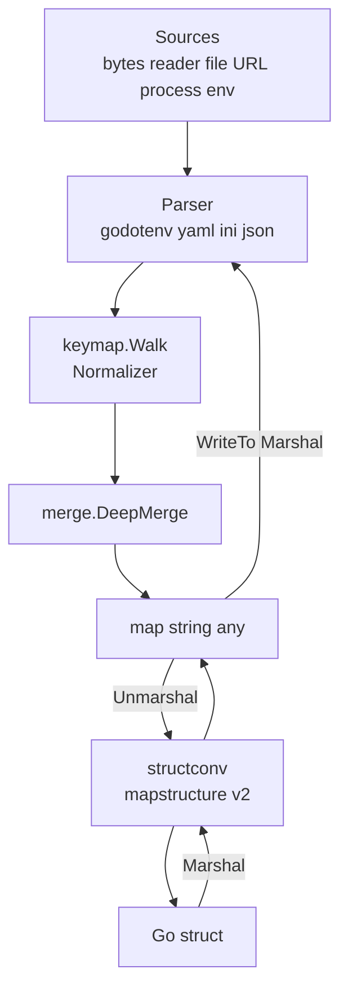

# go-config

[](https://pkg.go.dev/github.com/eslider/go-config)
[](https://opensource.org/licenses/MIT)
[](https://github.com/eSlider/go-config/releases/latest)
[](https://github.com/eSlider/go-config/actions/workflows/test.yml)
[](https://github.com/eSlider/go-config/actions/workflows/lint.yml)
[](https://goreportcard.com/report/github.com/eslider/go-config)
[](https://github.com/eSlider/go-config/stargazers)

Convert **env**, **YAML**, **JSON**, and **INI** to and from Go `map[string]any` and structs. Multi-source inputs merge with **deep map merge**: nested maps combine, **scalar leaves are last-write-wins**, and **slices** default to **replace** (opt-in **concat** via `WithSliceMerge`). Keys are normalized with a configurable **lower+alnum** rule so `sub-service`, `SUB_SERVICE`, and `SubService` line up across formats. Built on [go-viper/mapstructure/v2](https://github.com/go-viper/mapstructure).

## Architecture



## Hero example

```go
yamlCfg := yaml.New(yaml.WithURL("https://raw.githubusercontent.com/eSlider/mail-archive/refs/heads/master/docker-compose.yml"))
envCfg := env.New(
	env.WithFile(".default.env"), // lowest priority
	env.WithFile(".env"),
	env.WithCurrentEnvironment(), // highest priority — process env wins
)

var svc MyService
_ = yamlCfg.Unmarshal(&svc)
_ = envCfg.Unmarshal(&svc) // later sources override earlier scalar leaves; maps recurse
```

- **Maps** merge recursively (sub-trees are combined, not replaced wholesale).
- **Scalar leaves**: last-write-wins when you list sources lowest → highest priority.
- **Slices**: `merge.Replace` by default; use `WithSliceMerge(merge.Concat)` to append.

Runnable offline variant: see `Example_hero_offline` in [example_hero_test.go](example_hero_test.go).

## Install

```sh
go get github.com/eslider/go-config
go install github.com/eslider/go-config/cmd/envc@latest
```

## Quick start

### 1. Single YAML file

```go
c := yaml.New(yaml.WithFile("config.yaml"))
var cfg AppConfig
if err := c.Unmarshal(&cfg); err != nil { /* ... */ }
```

### 2. JSON over HTTPS with a header

```go
c := json.New(
	json.WithURL("https://api.example.com/v1/config.json"),
	json.WithHTTPHeader("Authorization", "Bearer "+token),
)
var cfg AppConfig
_ = c.Unmarshal(&cfg)
```

### 3. Cross-format conversion (YAML → JSON)

```go
ctx := context.Background()
m, _ := yaml.New(yaml.WithFile("in.yaml")).Map(ctx)
b, _ := json.New().Marshal(m)
os.WriteFile("out.json", b, 0o644)
```

## CLI: `envc`

Install the binary from [**Install**](#install) (`go install …/cmd/envc@latest`). Every
subcommand uses **`--from`** and **`--to`** with one of **`yaml`**, **`json`**, **`ini`**,
**`env`**. Snippets use **`bash`** so you can copy-paste; replace paths and URLs with yours.

### Help and version

```bash
# Root usage (commands, short descriptions)
envc help

# Per-command flag reference (convert, merge, get)
envc convert -h
envc merge -h
envc get -h

# Version string, git commit, build date (release builds embed the tag; local go install → dev)
envc version
```

### `convert`

One input → normalize keys → one output. Defaults: **`--input -`**, **`--output -`**
(stdin / stdout).

```bash
# Helm-style values file → JSON on the terminal (redirect to a file if you prefer)
envc convert --from yaml --to json --input ./values.yaml --output -

# Teammate’s JSON app settings → YAML for a repo that only accepts YAML
envc convert --from json --to yaml --input ./settings.json --output ./settings.yaml

# Windows-style INI → JSON for a one-off jq filter
envc convert --from ini --to json --input ./odbc.ini --output ./odbc.json

# Remote YAML → materialize .env for `docker compose --env-file` or similar
envc convert --from yaml --to env \
  --input "https://raw.githubusercontent.com/org/stack/main/config.yaml" \
  --output ./.env.generated

# Tiny inline document → JSON (stdin is the pipe; same idea as --input -)
printf 'service:\n  name: api\n  port: 8443\n' | envc convert --from yaml --to json
```

### `merge`

Several inputs in order: **nested maps combine**, **scalar leaves last-write-wins**, slices
default to **replace**. Optional **`--output -`** (stdout).

```bash
# Docker Compose: base + override → single JSON for another tool in the pipeline
envc merge --from yaml --to json \
  ./docker-compose.base.yaml \
  ./docker-compose.override.yaml

# App config: shipped defaults, local overrides, generated secrets → one merged YAML artifact
envc merge --from yaml --to yaml \
  --output ./config.merged.yaml \
  ./config.defaults.yaml \
  ./config.local.yaml \
  ./config.secrets.yaml

# Hotfix on stdin, then merge with on-disk YAML (--from must match every input, including stdin)
cat ./patch-canary.yaml | envc merge --from yaml --to json - ./config.base.yaml ./config.prod.yaml
```

### `get`

Print **one** scalar or JSON-encoded value. **`--path`** is dot-separated; each segment uses
the same **lower+alnum** rules as the library (`sub-service` / `SubService` → `subservice`).
Paths follow **maps only** (YAML lists are not walked by index here).

```bash
# Image line from docker-compose (good for scripts: stdout is just the value)
envc get --from yaml --path services.api.image ./docker-compose.yaml

# Nested string from an application config on disk
envc get --from yaml --path database.url ./config/app.yaml

# Same lookup, but YAML arrives from curl (positional "-" = read stdin to EOF)
curl -fsSL https://config.example.com/app.yaml | envc get --from yaml --path database.url -
```

### Load YAML or INI into the current shell

**`--to env`** emits **`KEY=value`** (shell assignments, not `export`). Use **`set -a`**
(allexport) so child processes inherit variables while you **`source`**. **`source <(…)`**
requires **bash**. Only use with **trusted** input (same risk as any `source`).

```bash
# Stack defaults from YAML into the current shell session
set -a
source <(envc convert --from yaml --to env --input ./.env.defaults.yaml)
set +a

# Legacy INI (e.g. PHP) → env-style assignments in the shell
set -a
source <(envc convert --from ini --to env --input ./legacy.ini)
set +a

# Inline YAML here-doc → env → source (CI or local; no intermediate file)
set -a
source <(cat <<'YAML' | envc convert --from yaml --to env
app:
  env: staging
  region: eu-west-1
YAML
)
set +a
```

### Stdin, URLs, and EOF

```bash
# Explicit stdin redirect (reads until EOF)
envc convert --from yaml --to json --input - --output - <./service.yaml

# Default is stdin/stdout — safe when stdin is a pipe or file; on an interactive TTY with no
# pipe, the process waits for Ctrl-D, which looks like a "hang". Prefer --input path/URL in scripts.
printf 'k: v\n' | envc convert --from yaml --to json

# HTTPS GET with client timeout; full body is read into memory before convert
envc convert --from json --to yaml \
  --input "https://api.example.com/v1/config.json" \
  --output ./snapshot.yaml
```

## API (all codecs)

| Method                                          | Description                       |
| ----------------------------------------------- | --------------------------------- |
| `New(opts...)`                                  | Construct codec                   |
| `Map(ctx)`                                      | Merged `map[string]any`           |
| `Unmarshal(dst)` / `UnmarshalContext(ctx, dst)` | Decode into struct (or map)       |
| `Marshal(src)` / `WriteTo(w, src)`              | Encode struct or `map[string]any` |

Shared options (each subpackage): `WithBytes`, `WithReader`, `WithFile`, `WithURL`, `WithHTTPHeader`, `WithHTTPClient`, `WithKeyNormalizer`, `WithSliceMerge`, `WithTrim`, `WithWeaklyTyped`, `WithTagName`, `WithDecodeHook`.

`env` adds: `WithCurrentEnvironment`, `WithPrefix`.

## Cross-format mapping

| Go                        | YAML                       | ENV                       |
| ------------------------- | -------------------------- | ------------------------- |
| `Service.SubService.Name` | `service.sub-service.name` | `SERVICE_SUBSERVICE_NAME` |

INI uses dotted sections, e.g. `[service.subservice]` with `name=...`.

## Related libraries

| Module                                                    | Role           |
| --------------------------------------------------------- | -------------- |
| [go-matrix-bot](https://github.com/eSlider/go-matrix-bot) | Matrix bots    |
| [go-onlyoffice](https://github.com/eSlider/go-onlyoffice) | OnlyOffice API |
| [go-ollama](https://github.com/eSlider/go-ollama)         | Ollama client  |

## Contributing

Testing expectations, local commands, commit message conventions, how **release-please**
and **GoReleaser** publish tags and `envc` binaries, and **architecture decisions** (repo
ASRs) are documented in **[CONTRIBUTING.md](CONTRIBUTING.md)**.

## License

MIT © Andriy Oblivantsev
