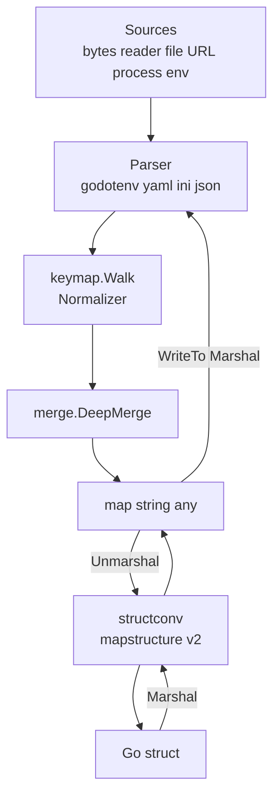

# go-config

[](https://pkg.go.dev/github.com/eslider/go-config)
[](https://opensource.org/licenses/MIT)
[](https://github.com/eSlider/go-config/releases/latest)
[](https://github.com/eSlider/go-config/stargazers)

Convert **env**, **YAML**, **JSON**, and **INI** to and from Go `map[string]any` and structs. Multi-source inputs merge with **deep map merge**: nested maps combine, **scalar leaves are last-write-wins**, and **slices** default to **replace** (opt-in **concat** via `WithSliceMerge`). Keys are normalized with a configurable **lower+alnum** rule so `sub-service`, `SUB_SERVICE`, and `SubService` line up across formats. Built on [go-viper/mapstructure/v2](https://github.com/go-viper/mapstructure).

## Architecture



## Hero example

```go
yamlCfg := yaml.New(yaml.WithURL("https://raw.githubusercontent.com/eSlider/mail-archive/refs/heads/master/docker-compose.yml"))
envCfg := env.New(
	env.WithFile(".default.env"), // lowest priority
	env.WithFile(".env"),
	env.WithCurrentEnvironment(), // highest priority — process env wins
)

var svc MyService
_ = yamlCfg.Unmarshal(&svc)
_ = envCfg.Unmarshal(&svc) // later sources override earlier scalar leaves; maps recurse
```

- **Maps** merge recursively (sub-trees are combined, not replaced wholesale).
- **Scalar leaves**: last-write-wins when you list sources lowest → highest priority.
- **Slices**: `merge.Replace` by default; use `WithSliceMerge(merge.Concat)` to append.

Runnable offline variant: see `Example_hero_offline` in [example_hero_test.go](example_hero_test.go).

## Install

```sh
go get github.com/eslider/go-config
go install github.com/eslider/go-config/cmd/envc@latest
```

## Quick start

### 1. Single YAML file

```go
c := yaml.New(yaml.WithFile("config.yaml"))
var cfg AppConfig
if err := c.Unmarshal(&cfg); err != nil { /* ... */ }
```

### 2. JSON over HTTPS with a header

```go
c := json.New(
	json.WithURL("https://api.example.com/v1/config.json"),
	json.WithHTTPHeader("Authorization", "Bearer "+token),
)
var cfg AppConfig
_ = c.Unmarshal(&cfg)
```

### 3. Cross-format conversion (YAML → JSON)

```go
ctx := context.Background()
m, _ := yaml.New(yaml.WithFile("in.yaml")).Map(ctx)
b, _ := json.New().Marshal(m)
os.WriteFile("out.json", b, 0o644)
```

## CLI: `envc`

| Command                                                            | Purpose                                                         |
| ------------------------------------------------------------------ | --------------------------------------------------------------- |
| `envc convert --from yaml --to env --input - --output -`           | Convert stdin YAML to dotenv on stdout                          |
| `envc get --from yaml --path service.name config.yaml`             | Print one path (dot-separated; segments normalized like codecs) |
| `envc merge --from yaml --to json --output out.json a.yaml b.yaml` | Deep-merge multiple YAML files, emit JSON                       |

## API (all codecs)

| Method                                          | Description                       |
| ----------------------------------------------- | --------------------------------- |
| `New(opts...)`                                  | Construct codec                   |
| `Map(ctx)`                                      | Merged `map[string]any`           |
| `Unmarshal(dst)` / `UnmarshalContext(ctx, dst)` | Decode into struct (or map)       |
| `Marshal(src)` / `WriteTo(w, src)`              | Encode struct or `map[string]any` |

Shared options (each subpackage): `WithBytes`, `WithReader`, `WithFile`, `WithURL`, `WithHTTPHeader`, `WithHTTPClient`, `WithKeyNormalizer`, `WithSliceMerge`, `WithTrim`, `WithWeaklyTyped`, `WithTagName`, `WithDecodeHook`.

`env` adds: `WithCurrentEnvironment`, `WithPrefix`.

## Cross-format mapping

| Go                        | YAML                       | ENV                       |
| ------------------------- | -------------------------- | ------------------------- |
| `Service.SubService.Name` | `service.sub-service.name` | `SERVICE_SUBSERVICE_NAME` |

INI uses dotted sections, e.g. `[service.subservice]` with `name=...`.

## Related libraries

| Module                                                    | Role           |
| --------------------------------------------------------- | -------------- |
| [go-matrix-bot](https://github.com/eSlider/go-matrix-bot) | Matrix bots    |
| [go-onlyoffice](https://github.com/eSlider/go-onlyoffice) | OnlyOffice API |
| [go-ollama](https://github.com/eSlider/go-ollama)         | Ollama client  |

## Decisions

Repo-local ASRs: [docs/asr/README.md](docs/asr/README.md).

## License

MIT © Andriy Oblivantsev
